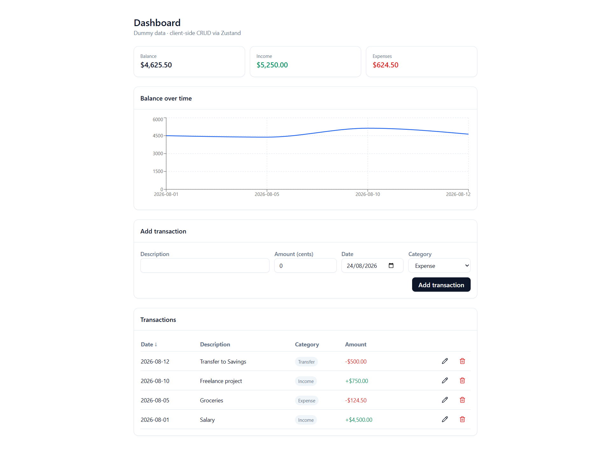

# fin-app

Minimal Next.js (App Router) + TypeScript financial dashboard with full client-side CRUD.



## Stack
- Next.js 15 (App Router) + TypeScript (strict)
- TanStack Query (provider wired, ready for real API)
- Zustand (CRUD store: create / update / delete / getById)
- Zod + React Hook Form (validated create & edit forms)
- shadcn-style UI primitives + Tailwind CSS
- TanStack Table (sortable transactions table, inline edit row)
- Recharts (running balance line chart)
- decimal.js (all money stored as integer cents, converted only at UI boundary)
- Vitest + Testing Library (unit tests for money math + CRUD store)
- Playwright (E2E, config not included — add `playwright.config.ts` when ready)

## Run it

```bash
npm install
npm run dev
```

Visit http://localhost:3000

## Test

```bash
npm run test
```

## File structure

```
src/
  app/
    layout.tsx          # root layout, wraps Providers
    page.tsx             # dashboard page
    providers.tsx         # TanStack Query provider
    globals.css
  components/
    ui/                   # button, input, label, card (shadcn-style primitives)
    transaction-form.tsx          # shared create/edit form (RHF + Zod)
    transaction-form-section.tsx  # wires form to store.create
    transactions-table.tsx        # TanStack Table, inline edit, delete
    balance-chart.tsx             # Recharts running balance
    summary-cards.tsx             # balance / income / expenses cards
  lib/
    money.ts              # decimal.js helpers, integer-cents convention
    schemas.ts             # Zod schemas + inferred types
    utils.ts               # cn() class merge helper
  store/
    transactions.ts        # Zustand store: create, update, remove, getById
tests/
  money.test.ts
  transactions-store.test.ts
```

## Money convention
All amounts are stored and passed around as **integer cents**. Only convert to `Decimal`
(via `fromCents`/`toCents` in `src/lib/money.ts`) at the point of display or user input.
Never do raw float arithmetic on money values elsewhere in the app.
